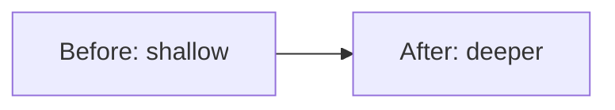

# /map-architecture — Architecture-Deepening Report

Proactively find where a deeper module buys future leverage, ranked by evidence.

**Scope:** $ARGUMENTS

## Effort and Parallelism Policy

```yaml
thinking_policy: medium/adaptive
parallel_tool_policy: research_only
```

- Use medium reasoning for friction scoring, candidate ranking, and the top recommendation.
- Parallelize ONLY independent read-only research probes over different candidate files.
- Phase 1 (scope), Phase 2 (report write), and Phase 3 (select) are strictly sequential.
- No code changes in this skill. If a user presses for implementation, decline and hand off.

## Phase 1 — Scope

### 1.1 Determine candidate areas

Parse `$ARGUMENTS`:

- **User-specified scope**: a module path (`src/mapify_cli/delivery/`), a pain point in prose (`"copier and installer are tangled"`), or a comma-separated list of files. Use it as the primary analysis scope.
- **No argument**: derive scope from recent git hotspot analysis:

```bash
BRANCH=$(git rev-parse --abbrev-ref HEAD)
git log --since="90 days ago" --name-only --pretty=format: | \
  grep -v '^$' | sort | uniq -c | sort -rn
```

Take the top 10 most-changed files. Filter out: lock files, migration files, generated output trees, changelog, and test fixtures — these change for non-design reasons.

### 1.2 Load context artifacts

Read the following when present (do not error if absent):

- `docs/ARCHITECTURE.md` — system design
- `.map/wayfind/*/state.json` — open design decisions
- `docs/adr/*.md` or `ADR*.md` in any top-level path — recorded decisions

Do not invent domain terms. If a concept has no clear name, use the code identifier and mark it `[domain: unknown]`.

## Phase 2 — Report

### 2.1 Score each candidate

For each in-scope file or module, assess these signals and score 0–2 (0 = absent, 1 = mild, 2 = strong):

| Signal | What to look for |
|---|---|
| Change frequency | High `git log` count in scope window |
| Shallow interface | Many small exports, each requiring caller-held context |
| Low locality | Understanding one concept requires reading N > 3 files |
| Seam leakage | Internal type or state escapes an abstraction boundary |
| Hard to test | No unit tests, or tests require deep mocking |
| ADR conflict | Behavior contradicts a recorded architectural decision |

Total score = sum of signal scores. Rank candidates descending. Report at least 3 candidates or a "not enough evidence" result when the top score is < 3 after scanning all in-scope files.

### 2.2 Determine output paths

```bash
BRANCH=$(git rev-parse --abbrev-ref HEAD)
REPORT_DIR=".map/${BRANCH}/architecture-report"
mkdir -p "$REPORT_DIR"
```

### 2.3 Write report.md

Write `.map/<branch>/architecture-report/report.md` with this structure:

```markdown
# Architecture-Deepening Report

Generated: <YYYY-MM-DD>
Branch: <branch>
Scope: <user argument or "git hotspot — last 90 days">

## Summary

<1–2 sentences on overall architecture health in the scoped area.>

## Candidates

### Candidate 1 — <title> [Strength: HIGH | MEDIUM | LOW]

**Files:** `<path>`
**Score:** <N>/12
**Evidence:**
- Change frequency: <N changes in 90 days>
- <signal name>: `<file>:<line>` — <one-line quote or observation>
**Problem:** <1–3 sentences — what the shallow structure costs today and in future changes>
**Proposed direction:** <bounded deepening opportunity — not a rewrite>
**Expected benefits:** locality | testability | AI-navigability
**Risk:** <what could go wrong with this deepening>



### Candidate 2 — ...

### Candidate 3 — ...

## Top recommendation

**<title>** — <one sentence rationale>

> Do not implement yet. Pick a candidate below, then run /map-plan or /map-fast.

## When to refresh this report

<Conditions that make this report stale, e.g. "after next major change to <module>".>
```

### 2.4 Write report.json

Write `.map/<branch>/architecture-report/report.json`:

```json
{
  "generated": "<ISO date>",
  "branch": "<branch>",
  "scope": "<scope string>",
  "candidates": [
    {
      "rank": 1,
      "title": "...",
      "files": ["..."],
      "score": 9,
      "strength": "HIGH",
      "problem": "...",
      "direction": "...",
      "risks": "..."
    }
  ],
  "top_recommendation": "<title>"
}
```

This companion file lets future evals assert candidate count, evidence refs, and top pick.

### 2.5 Report guardrails

- Do not propose broad rewrites. Candidates must be bounded deepening opportunities.
- Do not contradict ADRs without concrete file/line evidence of friction.
- Do not invent domain terms.
- Do not require external network resources. Report is self-contained.
- Do not store secrets or large private content in the report.
- **No code changes in this phase.** The report is a decision aid.

## Phase 3 — Select

After writing the report, show the candidates to the user and ask:

> Which candidate would you like to explore? Reply with the candidate number, its title, or `none` to defer.

### If the user picks a candidate

Determine the recommended handoff:

| Condition | Recommend |
|---|---|
| Score ≥ 6 or involves multiple files | `/map-plan "<candidate title>"` |
| Score < 6 or bounded single-file change | `/map-fast "<candidate title>"` |

Tell the user the recommended next command. **Do not begin implementation here.**

### If the user declines all candidates

Ask whether to record a deferral note to avoid re-surfacing the same candidates next run:

```bash
cat >> .map/architecture-notes.md << 'EOF'
## Deferred <YYYY-MM-DD>
- <candidate title>: <user reason>
EOF
```

## When to use this skill vs others

| Need | Skill |
|---|---|
| Review current diff before merge | `/map-review` |
| Plan a specific feature or task | `/map-plan` |
| Fix a known bug | `/map-debug` |
| Capture session lessons | `/map-learn` |
| Periodic architecture health check | `/map-architecture` |

## Examples

```
/map-architecture
/map-architecture src/mapify_cli/delivery/
/map-architecture "the copier and installer feel tangled"
/map-architecture src/foo.py,src/bar.py
```

## Troubleshooting

- **Issue:** Fewer than 3 candidates found. **Fix:** Widen scope by including more hotspot files, or ask the user for a broader module path before re-running Phase 2.
- **Issue:** All signals score 0 across every candidate. **Fix:** Report "not enough evidence for deepening candidates in the given scope" and suggest checking back after more changes accumulate. Do not invent friction.
- **Issue:** ADR file not found. **Fix:** Skip the ADR-conflict signal row; mark the column as "no ADRs present" in the report.
- **Issue:** The user wants to implement immediately. **Fix:** Remind them to pick one candidate from the report, then run `/map-plan` or `/map-fast` — implementation is out of scope for this skill.
- **Issue:** `git log` returns nothing (empty repo or no commits in window). **Fix:** Fall back to static analysis only; note in the report that change-frequency data is unavailable.
